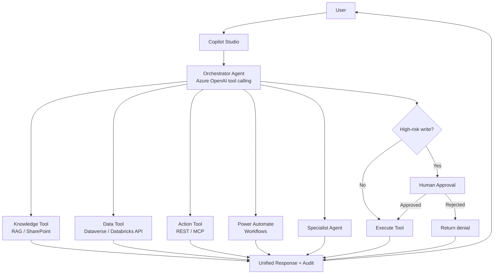

# Agentic Workflow Architecture

**Sanitized Reference Architecture**

Orchestrator decides among knowledge, structured data, APIs, workflows, specialist agents, or refusal—with human approval for high-risk writes.

## Design notes

- Scope each tool identity to the minimum APIs and tables required.
- Log every tool invocation with user identity and correlation ID.
- Prefer MCP or curated OpenAPI connectors over ad-hoc credential use in prompts.
