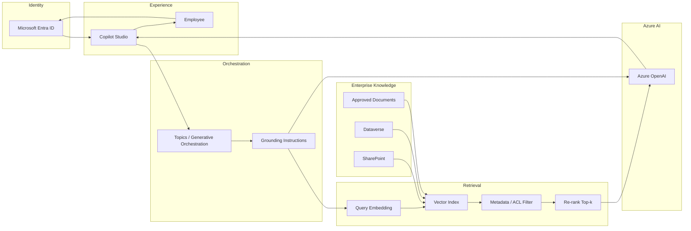

# Enterprise Copilot Architecture

**Sanitized Reference Architecture**

Employee-facing knowledge assistant: Copilot Studio orchestration with RAG grounding on Azure OpenAI and enterprise content sources.

## Information flow

1. User authenticates with Entra ID and opens Copilot Studio.
2. Orchestration applies grounding rules and builds a retrieval query.
3. Vector search returns candidates; ACL/metadata filters enforce authorization.
4. Azure OpenAI generates an answer constrained to retrieved context.
5. Response returns to the user with citations to permitted sources.
