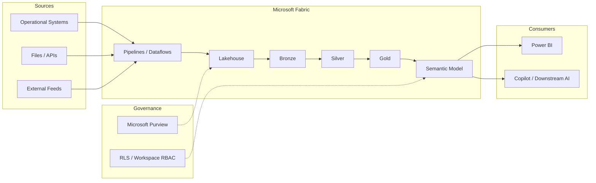

# Microsoft Fabric + Copilot Architecture

**Sanitized Reference Architecture**

Medallion lakehouse and semantic models as the governed substrate for Power BI and AI.

## Design notes

- AI should consume Gold / semantic-model outputs, not raw Bronze tables, whenever possible.
- Encode business logic and quality rules once in the lakehouse and model layers.
- Apply RLS so conversational access cannot exceed report-level entitlements.
