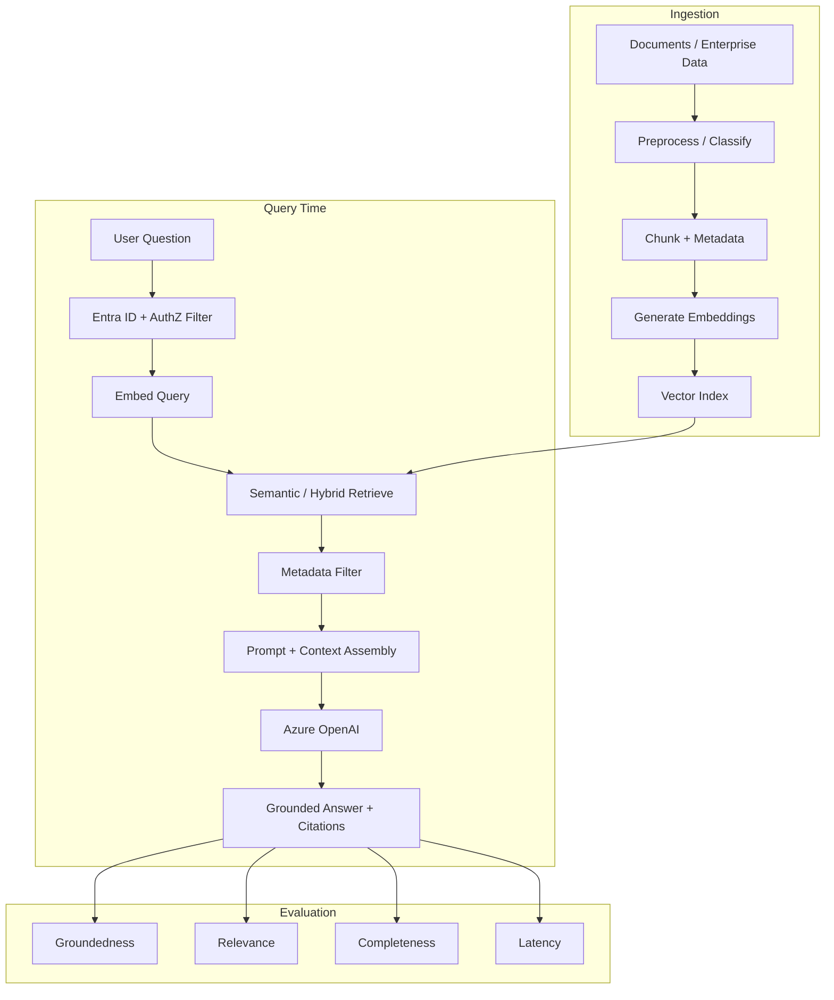

# Enterprise RAG Architecture

**Sanitized Reference Architecture**

End-to-end retrieval-augmented generation for regulated knowledge Q&A.

## Design notes

- Prefer authorization-aware retrieval before generation.
- Keep system instructions separate from retrieved text to reduce prompt-injection risk.
- Use evaluation gates before promoting index or prompt changes to production.
