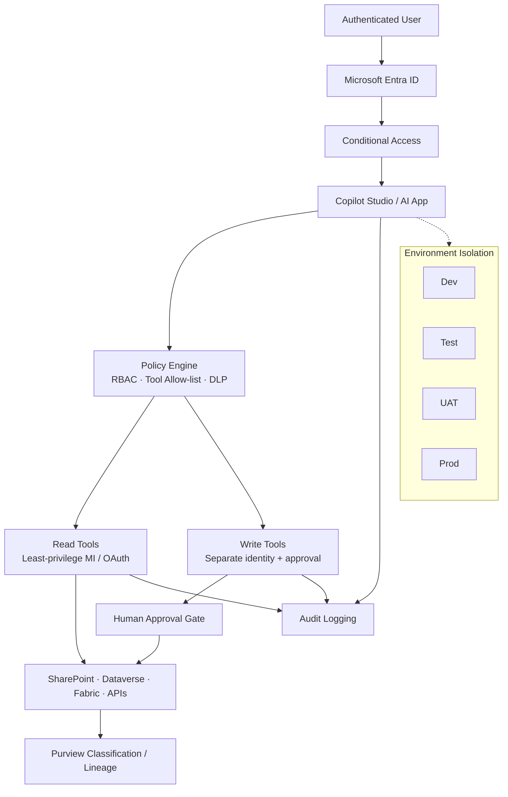

# Security & Governance Architecture

**Sanitized Reference Architecture**

Controls ensuring Copilot and agents do not exceed the authenticated user’s entitlements.

## Principle

An AI agent should never provide access to information or operations that the authenticated user would not normally be authorized to access.
